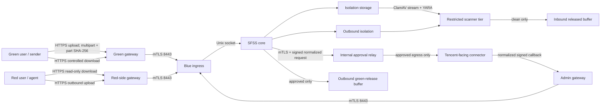

# SFSS four-zone production-candidate architecture

This is the deployment baseline for the stated network: green users have Internet access but no red route; yellow users have no general Internet access and can reach the red graphical environment; blue is the exchange zone; red holds core data and has no Internet route. It is a production-candidate design, not evidence that the target firewalls, PKI, or hosts are correctly deployed.

## Component placement

| Zone | Components | What users can see | Prohibited placement |
|---|---|---|---|
| Green | Green Nginx gateway; optional inbound `sfss-agent` | inbound upload and approved outbound download only | SFSS database, released-red buffer, scanner, approval credentials |
| Yellow | Red-side portal gateway, administration gateway, internal approval relay | red buffer/download portal, outbound upload portal, separate administrator UI | file payload storage, Tencent CorpSecret in the SFSS core |
| Blue | mTLS ingress Nginx, SFSS core over Unix socket, isolation/release storage candidate, scan-job coordinator | no direct end-user access | public Internet listener, user-bypass TCP listener |
| Red | red browser/agent reached through the approved yellow graphical path | released inbound download and outbound upload only | Internet egress, green route, SFSS administration |

The Tencent-facing half of enterprise approval needs a narrowly controlled corporate egress service or DMZ because the stated yellow, blue, and red zones have no Internet access. Keep the repository-defined relay endpoint on the internal side; let a separately reviewed connector hold the CorpSecret and communicate with Tencent. If no approved egress service exists, WeCom approval remains disabled and outbound files cannot be released.

## Data flows

Files never move directly from green to red or red to green. They pass through a distinct database state, isolated storage, content-derived type decision, conjunctive scanner decision, and—for outbound files—enterprise approval. Do not replace these transitions with a shared cross-zone filesystem mount, SFTP account that can browse both sides, or an operator copy step.

## Minimum network policy

Every row is default-deny except the exact source, destination, protocol, port, and workload identity shown. Addresses are target-environment inputs, not values to copy from the examples.

| Source | Destination | Protocol | Purpose | Required identity/control |
|---|---|---|---|---|
| Green clients | Green gateway | TCP/443 | upload; approved outbound download | TLS, application authentication, project/IP policy |
| Green gateway | Blue ingress | TCP/8443 | green API proxy | gateway mTLS certificate and current CRL |
| Red clients/agents | Red-side gateway | TCP/443 | released inbound download; outbound upload | TLS, application/service token, project/IP policy |
| Red-side gateway | Blue ingress | TCP/8443 | red API proxy | gateway mTLS certificate and current CRL |
| Yellow administrators | Admin gateway | TCP/443 | administration/observability | management CIDR, TLS, LDAP session, MFA upstream |
| Admin gateway | Blue ingress | TCP/8443 | admin API/callback proxy | admin mTLS certificate and current CRL |
| Blue ingress | SFSS core | Unix socket only | application request | OS user/group boundary; no application TCP listener |
| SFSS core | AD | TCP/636 | interactive authentication | LDAPS, pinned enterprise CA; exact firewall destination |
| SFSS core | scanner tier | approved internal ports | content scanning | workload firewall; no scanner exposure to users |
| SFSS core | internal approval relay | TCP/443 | outbound approval request | mTLS plus independent HMAC key |
| Approved connector | Admin gateway callback | TCP/443 | normalized final decision | source allowlist, mTLS, timestamp/nonce/HMAC |
| Monitoring/SIEM | Admin gateway | TCP/443 | readiness/metrics; controlled audit handoff | management identity and allowlist |

Explicitly deny green-to-red, green-to-blue, red-to-green, red-to-blue, end-user-to-blue, and all blue/red general Internet routes. “No route” must be demonstrated from representative hosts; a diagram or firewall rule review alone is not acceptance evidence.

## Storage and scaling boundary

The current SQLite/filesystem implementation is a single-node controlled-pilot candidate. Keep `/srv/sfss` only in blue, mode `0700`, on encrypted storage with separately controlled backups. Do not NFS-share the live SQLite directory. Production-scale/HA deployment requires approved PostgreSQL HA, a durable broker, versioned encrypted object storage, KMS/HSM secrets, and immutable audit export while preserving the same state-machine and fail-closed invariants.

Large transfers use multipart upload and HTTP Range download through the packaged Agent. Align chunk size, gateway body limits, core I/O timeout, Agent timeout, systemd drain time, scanner stream limit, storage reserve, and tested link throughput. The default 32 MiB part fits the 140 MiB gateway limit; the full 2 GiB example object is never accepted as one production request.

## Acceptance evidence

Before enabling traffic, collect target-host `nginx -t`, `systemd-analyze security`, socket/listener inventory, firewall reachability and bypass results, certificate/CRL validation, real LDAPS login/disable tests, scanner limit and malware tests, multipart interruption tests, approval replay/loss tests, load/soak results, immutable audit receipt, and backup restore evidence. The authoritative checklist is [PRODUCTION_ACCEPTANCE.md](PRODUCTION_ACCEPTANCE.md).
